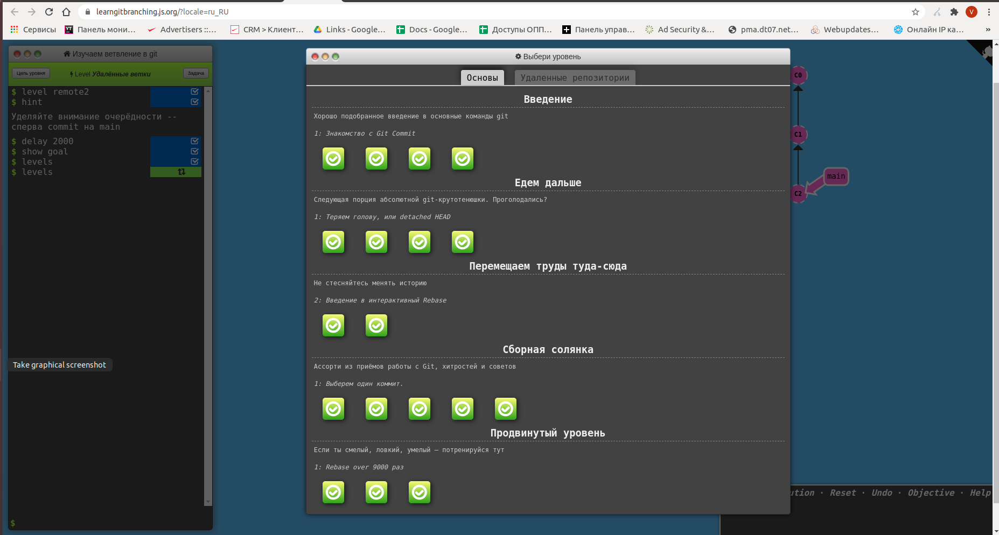
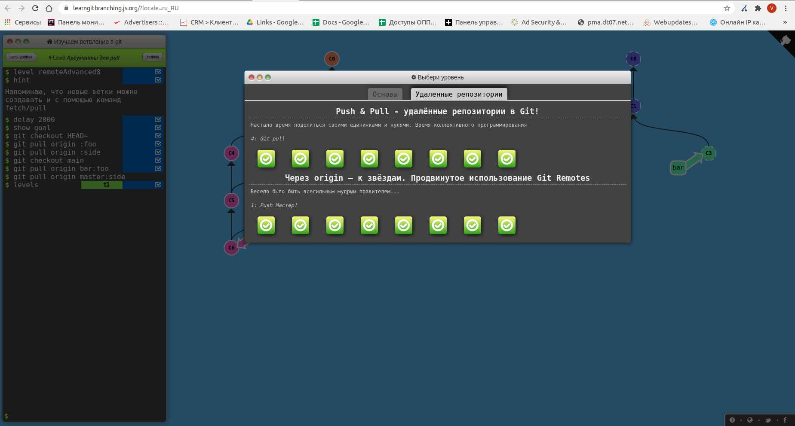

# kottans-frontend
Front-end course from Kottans
- **Tasks Progress**
- [ ] Git intro
- [ ] Linux CLI, HTTP
- [ ] Git for Team Collaboration
- [ ] Front-End Basics
- [ ] Responsive Layouts
- [ ] HTML & CSS Practice - practice
- [ ] JavaScript Basics
- [ ] Document Object Model - practice
- [ ] Building a Tiny JS World (pre-OOP) - practice
- [ ] Object-Oriented JavaScript - practice
- [ ] OOP exercise - practice
- [ ] Offline Web Applications - optional
- [ ] Memory – Pair Game - practice
- [ ] Website Performance Optimization - optional
- [ ] Friends App - practice

### 1. Git intro
This task a little bit extaned my understanging of git and showed the way to grow up

Screenshots

- 
- 
- 

